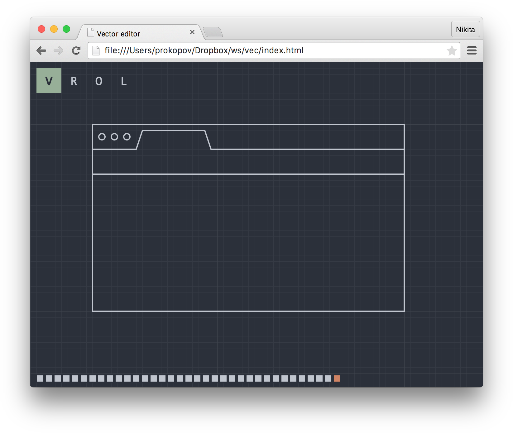

# React.js + Immutable.js vector editor example

App written during http://dou.ua/calendar/7213/

- Immutable model
- Fast reference-comparison `shouldComponentUpdate` on everything
- Speculative rendering
- Undo/redo
- `localStorage` persistence
- vanilla.js

Check out [vec.js](https://github.com/tonsky/vec/blob/gh-pages/vec.js), it’s decently commented.

Read more [about approach](http://tonsky.me/talks/2015-codefest/) (in Russian).

[Live version](http://tonsky.me/vec/)

